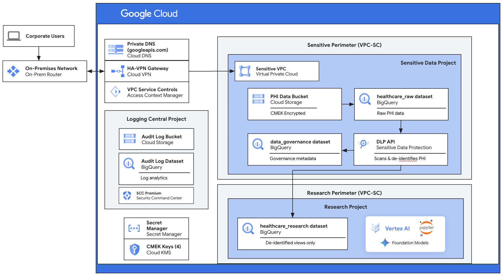

# HIPAA/FedRAMP GCP Environment Implementation

This repository implements a secure, compliant healthcare research environment on Google Cloud that meets HIPAA and FedRAMP compliance requirements.



## Implementation Phases

### Phase Structure

```
hipaa-sandbox/
├── 00-prerequisites/      # Environment validation
├── 01-foundation/         # Assured Workloads & projects
├── 02-networking/         # VPC, VPN, DNS configuration
├── 03-security-controls/  # VPC Service Controls setup
├── 04-logging-monitoring/ # Centralized logging & SCC
├── 05-data-security/      # CMEK and Secret Manager
├── 06-data-pipeline/      # De-identification & research access
└── config/                # Central configuration
```

## Prerequisites

### Required Permissions

You must have these roles at the **Organization** level:
- `roles/resourcemanager.organizationAdmin`
- `roles/billing.admin`
- `roles/accesscontextmanager.policyAdmin`
- `roles/securitycenter.admin`

### Required Tools

```bash
# Check if tools are installed
gcloud version          # Google Cloud SDK
gsutil version          # Cloud Storage CLI
bq version              # BigQuery CLI
curl --version          # HTTP client
jq --version            # JSON processor (optional but recommended)
```

### Configuration

1. Edit `config/environment.conf` and update these required fields:

#### Organization Settings (REQUIRED)
```bash
# Your Google Cloud Organization ID
# Find this by running: gcloud organizations list
export ORG_ID=""  # Example: "123456789012"

# Your active billing account
# Find this by running: gcloud beta billing accounts list --filter=open=true
export BILLING_ACCOUNT_ID=""  # Example: "ABCDEF-123456-GHIJKL"

# Your organization's email domain
export ORGANIZATION_DOMAIN=""  # Example: "yourcompany.com"

# Short identifier for resource naming (lowercase, no spaces)
export ORGANIZATION_SHORT=""  # Example: "acme" or "myorg"

# Full organization name (optional)
export ORGANIZATION_NAME="Your Organization"  # Example: "Acme Healthcare"
```

#### Regional Configuration (REQUIRED)
```bash
# Choose your deployment location strategy
export LOCATION_TYPE="single-region"  # Options: "single-region" or "multi-region"

# For single-region deployment, choose from FedRAMP-approved regions:
# us-central1, us-east1, us-east4, us-west1, us-west2, us-west3, us-west4
# northamerica-northeast1, northamerica-northeast2, southamerica-east1
# europe-west1, europe-west2, europe-west3, europe-west4, europe-north1
# asia-south1, asia-southeast1
export REGION="us-central1"  # Used for single-region deployments

# For multi-region deployment (storage and BigQuery)
export MULTI_REGION="US"     # Options: "US" (United States), "EU" (European Union)

# Note: Multi-region is more expensive but provides higher availability
# Single-region: $0.020/GB/month, Multi-region: $0.026/GB/month (30% more)
```

#### Identity Configuration (REQUIRED)
```bash
# IMPORTANT: Provide your existing Google Workspace group identities
# These groups should already exist in your organization with appropriate members
# Each group will be granted specific permissions in the GCP environment

# Core administrative and security groups
export SECURITY_TEAM_GROUP=""           # Example: "security-team@yourcompany.com"
export ADMIN_GROUP=""                   # Example: "cloud-admins@yourcompany.com"
export HEALTH_ADMINS_GROUP=""           # Example: "health-system-admins@yourcompany.com"

# Research and data access groups
export RESEARCHERS_GROUP=""             # Example: "health-researchers@yourcompany.com"
export RESEARCH_ADMINS_GROUP=""         # Example: "research-admins@yourcompany.com"
export RESEARCH_DATA_GROUP=""           # Example: "data-team@yourcompany.com"
export EXTERNAL_COLLABORATORS_GROUP=""  # Example: "external-partners@yourcompany.com"

# Compliance and governance groups
export PRIVACY_GROUP=""                 # Example: "privacy-office@yourcompany.com"
export DATA_GOVERNANCE_GROUP=""         # Example: "data-governance@yourcompany.com"
export HEALTH_IT_GROUP=""               # Example: "health-it@yourcompany.com"
```

#### Network Configuration (REQUIRED)
```bash
# Your organization's public IP ranges for admin access
# Format: Comma-separated CIDR blocks
# These IPs will be allowed to access the environment for administration
export CORPORATE_IP_RANGES=""  # Example: "203.0.113.0/24,198.51.100.0/24" - REPLACE WITH YOUR ACTUAL PUBLIC IPs

# Your on-premises network range (if using hybrid connectivity)
# Leave empty if not using VPN
export ON_PREM_NETWORK_RANGE=""  # Example: "10.0.0.0/8" or "192.168.0.0/16" - REPLACE WITH YOUR ACTUAL RANGE
```

#### VPN Configuration (REQUIRED only if using hybrid connectivity)
```bash
# Your on-premises VPN gateway public IP
export PEER_IP=""  # Example: "203.0.113.1" - REPLACE WITH YOUR VPN ENDPOINT IP

# Pre-shared key for VPN (generate with: openssl rand -base64 32)
export SHARED_SECRET=""  # REPLACE WITH YOUR GENERATED SHARED SECRET

# Your on-premises BGP ASN
export PEER_ASN=""  # Example: "64513" - REPLACE WITH YOUR ASN
```

2. Source the configuration:
```bash
source config/environment.conf
```

3. Validate your configuration:
```bash
cd 00-prerequisites
./validate-setup.sh
```

## Step-by-Step Implementation

### Phase 00: Prerequisites ✓

```bash
cd 00-prerequisites
./check-requirements.sh      # Validates tools and permissions
./set-environment.sh         # Loads configuration
./validate-setup.sh          # Confirms all settings correct
```

#### Summary Table

| Script | Purpose | Specific Configurations |
|--------|---------|------------------------|
| `check-requirements.sh` | Verify tools & permissions | - Validates gcloud CLI installation<br>- Checks organization admin permissions<br>- Verifies billing account access<br>- Ensures required APIs can be enabled |
| `set-environment.sh` | Load configuration | - Organization ID: `${ORG_ID}`<br>- Billing Account: `${BILLING_ACCOUNT_ID}`<br>- Organization Domain: `${ORGANIZATION_DOMAIN}`<br>- Organization Short Name: `${ORGANIZATION_SHORT}`<br>- Location Type: `${LOCATION_TYPE}` (single-region or multi-region)<br>- Region: `${REGION}` (configurable, FedRAMP approved regions)<br>- Multi-Region: `${MULTI_REGION}` (if using multi-region)<br>- Creates folder name: `${ORGANIZATION_SHORT}-Health-Sciences-Secure` |
| `validate-setup.sh` | Validate all settings | - Confirms all required environment variables are set<br>- Validates network ranges are specified<br>- Checks VPN configuration if hybrid connectivity enabled |

### Phase 01: Foundation 🏗️

```bash
cd ../01-foundation
./create-folder.sh           # Creates folder structure
```

**⚠️ MANUAL STEP: Create Assured Workloads**
1. Navigate to [Google Cloud Console - Assured Workloads](https://console.cloud.google.com/compliance/assuredworkloads)
2. Click "Create workload"
3. Select the folder that was created: `[your-org-short]-Health-Sciences-Secure`
4. Choose compliance regime: **FedRAMP Moderate**
5. Review the controls that will be applied:
   - Service restrictions (FedRAMP-approved services only)
   - Data residency (US regions only)
   - Personnel access controls
6. Complete the setup wizard
7. **Note**: Organization policies cannot be modified after creation

```bash
# Continue with automated steps
./create-projects.sh         # Creates 3 projects
./enable-apis.sh             # Enables 15+ required APIs
```

#### Summary Table

| Script | Purpose | Specific Configurations |
|--------|---------|------------------------|
| `create-folder.sh` | Create GCP folder | - Folder: `${ORGANIZATION_SHORT}-Health-Sciences-Secure`<br>- Parent: Organization root<br>- Purpose: Isolate health-related projects |
| `create-projects.sh` | Create 3 projects | **Production Project:**<br>- ID: `${ORGANIZATION_SHORT}-health-sciences-prod`<br>- Name: `${ORGANIZATION_NAME} Health Sciences Production`<br><br>**Logging Project:**<br>- ID: `${ORGANIZATION_SHORT}-health-logging-central`<br>- Name: `${ORGANIZATION_NAME} Health Logging Central`<br><br>**Research Project:**<br>- ID: `${ORGANIZATION_SHORT}-health-research-lake`<br>- Name: `${ORGANIZATION_NAME} Health Research Lake` |
| `enable-apis.sh` | Enable required APIs | **Core APIs enabled in all projects:**<br>- `cloudresourcemanager.googleapis.com`<br>- `compute.googleapis.com`<br>- `storage.googleapis.com`<br>- `bigquery.googleapis.com`<br>- `logging.googleapis.com`<br>- `monitoring.googleapis.com`<br>- `cloudkms.googleapis.com`<br>- `serviceusage.googleapis.com`<br><br>**Research Project:** Researchers can self-enable any Assured Workloads compatible API |

### Phase 02: Networking 🌐

```bash
cd ../02-networking
./create-vpc.sh              # Dedicated VPC with custom subnets
./configure-firewall.sh      # 10 firewall rules (deny-all default)
./setup-vpn.sh               # HA-VPN with BGP routing
```

**⚠️ MANUAL STEP: Configure On-Premises DNS**
Configure your on-premises DNS servers:
1. Create forward zone for `googleapis.com`
2. Point `*.googleapis.com` to restricted VIP:
   ```
   199.36.153.4
   199.36.153.5
   199.36.153.6
   199.36.153.7
   ```
3. Test resolution:
   ```bash
   nslookup storage.googleapis.com
   # Should return restricted IP
   ```

```bash
# Continue with automated DNS configuration
./configure-dns.sh           # Private DNS for googleapis.com
```

#### Summary Table

| Script | Purpose | Specific Configurations |
|--------|---------|------------------------|
| `create-vpc.sh` | Create dedicated VPC | **VPC Configuration:**<br>- Name: `${ORGANIZATION_SHORT}-health-secure-vpc`<br>- Mode: Custom subnets (not auto-mode)<br>- BGP Routing: Regional<br><br>**Subnet Configuration:**<br>- Name: `${ORGANIZATION_SHORT}-health-subnet`<br>- CIDR: `10.0.0.0/24`<br>- Private Google Access: Enabled<br>- Flow Logs: Enabled (100% sampling)<br><br>**Route for Restricted APIs:**<br>- Destination: `199.36.153.4/30`<br>- Next-hop: Default internet gateway<br>- Priority: 100 |
| `configure-firewall.sh` | Set firewall rules | **Ingress Rules (Default Deny):**<br>- `deny-all-ingress`: Priority 65534, Deny all from 0.0.0.0/0<br>- `allow-internal`: Priority 1000, Allow all from subnet (10.0.0.0/24)<br>- `allow-ssh-from-corp`: Priority 1000, TCP:22 from `${CORPORATE_IP_RANGES}`<br>- `allow-ssh-from-onprem`: Priority 1000, TCP:22 from `${ON_PREM_NETWORK_RANGE}`<br>- `allow-health-checks`: Priority 1000, TCP from Google health check ranges<br>- `allow-established`: Priority 1100, Stateful connections<br><br>**Egress Rules (Default Deny):**<br>- `deny-all-egress`: Priority 65534, Deny all to 0.0.0.0/0<br>- `allow-google-apis-egress`: Priority 1000, TCP:443 to Google APIs<br>- `allow-internal-egress`: Priority 1000, Allow all to subnet<br>- `allow-dns-egress`: Priority 1000, TCP/UDP:53 to anywhere |
| `setup-vpn.sh` | Configure HA-VPN | - Gateway: `${ORGANIZATION_SHORT}-health-vpn-gateway`<br>- Cloud Router: `${ORGANIZATION_SHORT}-health-cloud-router`<br>- Cloud Router ASN: `64512`<br>- Tunnel: `${ORGANIZATION_SHORT}-health-vpn-tunnel`<br>- Peer IP: `${PEER_IP}`<br>- Peer ASN: `${PEER_ASN}`<br>- Pre-shared Key: `${SHARED_SECRET}` |
| `configure-dns.sh` | Set DNS for restricted APIs | - Private zone for `googleapis.com`<br>- A records for `restricted.googleapis.com`: 199.36.153.4-7<br>- CNAME for `*.googleapis.com` → `restricted.googleapis.com` |

### Phase 03: Security Controls 🔒

```bash
cd ../03-security-controls
./setup-access-context.sh    # 3 access levels (on-prem, corp, users)
./create-perimeters.sh       # 2 VPC-SC perimeters (dry-run)
./configure-ingress-rules.sh # Ingress/egress policies
```

**⚠️ MANUAL STEP: Analyze VPC Service Controls Dry-Run Logs**
1. Wait 24-48 hours for dry-run logs to accumulate
2. Analyze access patterns:
   ```bash
   gcloud logging read 'protoPayload.metadata.@type="type.googleapis.com/google.cloud.audit.VpcServiceControlAuditMetadata"' \
     --project=${PROJECT_ID} \
     --format=json | jq '.'
   ```
3. Document legitimate access patterns
4. Update ingress/egress rules as needed
5. Only proceed after thorough testing

```bash
# After analysis period, enforce perimeters
./enforce-perimeters.sh      # Switch to enforcement mode
```

#### Summary Table

| Script | Purpose | Specific Configurations |
|--------|---------|------------------------|
| `setup-access-context.sh` | Create access levels | - Access Policy: `${ORGANIZATION_NAME} Health Sciences Access Policy`<br>- IP-based access levels for corporate ranges<br>- Device-based access levels (if configured) |
| `create-perimeters.sh` | Create VPC-SC perimeters | **Primary Perimeter:**<br>- Name: `${ORGANIZATION_SHORT}-health-secure-perimeter`<br>- Resources: Production + Logging projects<br>- Mode: Dry-run initially<br>- Restricted Services: Only `cloudresourcemanager.googleapis.com` and `iamcredentials.googleapis.com`<br>- Note: Assured Workloads handles other service restrictions<br><br>**Research Perimeter:**<br>- Name: `${ORGANIZATION_SHORT}-health-research-perimeter`<br>- Resources: Research project<br>- Mode: Dry-run initially<br>- Same minimal service restrictions |
| `configure-ingress-rules.sh` | Set ingress/egress rules | - Allow ingress from corporate IPs<br>- Allow egress to restricted.googleapis.com<br>- Block all other external access |
| `enforce-perimeters.sh` | Activate perimeters | - Switch from dry-run to enforced mode<br>- Enable violation logging<br>- Set up alerts for violations |

### Phase 04: Logging & Monitoring 📊

```bash
cd ../04-logging-monitoring
./setup-logging-project.sh   # BigQuery dataset + Storage bucket
./configure-log-sinks.sh     # Organization-level log routing
./enable-audit-logs.sh       # Data access logs for all services
```

**⚠️ MANUAL STEP: Activate Security Command Center Premium**
1. Navigate to [Security Command Center](https://console.cloud.google.com/security/command-center)
2. Click "Start Setup" or "Upgrade to Premium"
3. Select **Premium** tier
4. Review pricing and features:
   - Continuous compliance monitoring
   - HIPAA and FedRAMP dashboards
   - Advanced threat detection
5. Complete activation

```bash
# After SCC Premium activation
./setup-scc.sh               # Configure compliance monitoring
```

#### Summary Table

| Script | Purpose | Specific Configurations |
|--------|---------|------------------------|
| `setup-logging-project.sh` | Create logging infrastructure | - Dedicated logging project<br>- Log bucket: `${ORGANIZATION_SHORT}-health-audit-logs-${RANDOM}`<br>- BigQuery dataset: `${ORGANIZATION_SHORT}_health_audit_logs`<br>- Retention: Indefinite by default (optional compliance periods available) |
| `configure-log-sinks.sh` | Set up log routing | - Organization-level sink: `${ORGANIZATION_SHORT}-health-central-log-sink`<br>- Filters: All admin activity, data access logs<br>- Destination: Centralized log bucket<br>- Include children: Yes |
| `enable-audit-logs.sh` | Enable data access logs | - Admin Activity: Enabled (default)<br>- Data Read: Enabled for all services<br>- Data Write: Enabled for all services<br>- Services: All HIPAA-relevant APIs |
| `setup-scc.sh` | Configure Security Command Center | - Enable Premium tier<br>- Configure finding notifications<br>- Set up compliance dashboard<br>- Enable continuous scanning |

### Phase 05: Data Security 🛡️

**⚠️ MANUAL STEP: Accept HIPAA Business Associate Agreement**
Before handling any PHI data:
1. Navigate to [HIPAA BAA Console](https://console.cloud.google.com/security/compliance/baa)
2. Review the Business Associate Agreement
3. Understand your responsibilities:
   - Use only HIPAA-covered services
   - Implement required safeguards
   - Report breaches
4. Accept the agreement for your organization

```bash
cd ../05-data-security
./setup-cmek.sh                    # 4 encryption keys with rotation
./configure-storage-encryption.sh   # 3 encrypted buckets
./setup-secret-manager.sh          # Secret storage with rotation
```

#### Summary Table

| Script | Purpose | Specific Configurations |
|--------|---------|------------------------|
| `setup-cmek.sh` | Create encryption keys | **KMS Keyring:**<br>- Name: `${ORGANIZATION_SHORT}-health-keyring`<br>- Location: `${REGION}`<br><br>**Encryption Keys (90-day rotation):**<br>- `storage-key`: For Cloud Storage PHI/PII<br>- `database-key`: For Cloud SQL/databases<br>- `bigquery-key`: For BigQuery datasets<br>- `compute-key`: For VM disk encryption<br><br>**Service Account Permissions:**<br>- Storage SA: CryptoKeyEncrypterDecrypter<br>- BigQuery SA: CryptoKeyEncrypterDecrypter<br>- Compute SA: CryptoKeyEncrypterDecrypter |
| `configure-storage-encryption.sh` | Encrypt storage buckets | - PHI Bucket: `${ORGANIZATION_SHORT}-health-phi-data-${RANDOM}`<br>- Research Bucket: `${ORGANIZATION_SHORT}-health-research-data-${RANDOM}`<br>- Backup Bucket: `${ORGANIZATION_SHORT}-backups`<br>- Encryption: CMEK with storage-key<br>- Versioning: Enabled<br>- Retention: Indefinite by default (optional periods available) |
| `setup-secret-manager.sh` | Set up secret storage | - Enable Secret Manager API<br>- Create secrets for service accounts<br>- Set up automatic rotation<br>- Configure access controls |

### Phase 06: Data Pipeline 🔬

```bash
cd ../06-data-pipeline
./setup-perimeter-bridge.sh         # Cross-perimeter data flow
./setup-bigquery-dlp-infrastructure.sh  # Create BigQuery datasets
./setup-research-access.sh          # Configure researcher access
```

#### Summary Table

| Script | Purpose | Specific Configurations |
|--------|---------|------------------------|
| `setup-perimeter-bridge.sh` | Configure perimeter bridge | - Bridge between secure and research perimeters<br>- Service account for data transfers<br>- Audit logging enabled |
| `setup-bigquery-dlp-infrastructure.sh` | Set up BigQuery infrastructure | **Datasets Created:**<br>- Raw PHI: `${PROJECT_ID}:healthcare_raw`<br>- Governance: `${PROJECT_ID}:data_governance`<br>- Research: `${RESEARCH_PROJECT_ID}:healthcare_research`<br><br>**Permissions:**<br>- Service account granted cross-project access |
| `setup-research-access.sh` | Configure researcher access | **IAM Groups:**<br>- `${RESEARCHERS_GROUP}`<br>- `${RESEARCH_ADMINS_GROUP}`<br><br>**Research Project Access:**<br>- Editor + BigQuery Admin + Storage Admin permissions<br>- Can create own datasets, resources, and enable APIs<br>- Self-service within Assured Workloads boundaries<br><br>**PHI Protection:**<br>- NO access to raw PHI data (separate project/perimeter)<br>- Only access de-identified data after DLP processing<br>- VPC-SC enforces this separation |

#### Manual Data Pipeline Steps

After running the scripts above, you'll need to:

##### 1. Load PHI Data into BigQuery

```bash
# Option A: From Cloud Storage (CSV)
bq load \
  --source_format=CSV \
  --autodetect \
  --replace \
  ${PROJECT_ID}:healthcare_raw.patient_records \
  gs://${PHI_BUCKET}/patient_records.csv

# Option B: From Cloud Storage (JSON)
bq load \
  --source_format=NEWLINE_DELIMITED_JSON \
  --autodetect \
  --replace \
  ${PROJECT_ID}:healthcare_raw.patient_records \
  gs://${PHI_BUCKET}/patient_records.json

# Option C: Stream from application
# Use BigQuery streaming API in your application code
```

##### 2. Run DLP Scans to Identify Sensitive Columns

```bash
# Create DLP inspection job for BigQuery table
gcloud dlp jobs create \
  --project=${PROJECT_ID} \
  --location=global \
  --inspect-bigquery-table \
  --dataset-id=healthcare_raw \
  --table-id=patient_records \
  --min-likelihood=POSSIBLE \
  --info-types=PERSON_NAME,US_SOCIAL_SECURITY_NUMBER,DATE_OF_BIRTH,PHONE_NUMBER,EMAIL_ADDRESS,STREET_ADDRESS,MEDICAL_RECORD_NUMBER

# Check job status
gcloud dlp jobs list --project=${PROJECT_ID} --filter="state=DONE"

# View findings
gcloud dlp findings list ${JOB_ID} --project=${PROJECT_ID}
```

##### 3. Create De-identified Views for Researchers

Based on DLP findings, create views with appropriate transformations:

```sql
-- Example: Create de-identified patient view
CREATE OR REPLACE VIEW `${RESEARCH_PROJECT_ID}.healthcare_research.patient_demographics` AS
SELECT
  patient_id,
  -- Redact direct identifiers
  '[REDACTED]' as patient_name,
  '[REDACTED]' as ssn,
  
  -- Transform quasi-identifiers
  DATE_ADD(date_of_birth, INTERVAL CAST(RAND()*730-365 AS INT64) DAY) as date_of_birth_shifted,
  SUBSTR(zip_code, 1, 3) || '**' as zip_prefix,
  
  -- Keep non-PHI fields as-is
  diagnosis_code,
  treatment_outcome,
  lab_results
FROM `${PROJECT_ID}.healthcare_raw.patient_records`;

-- Grant access to researchers
GRANT `roles/bigquery.dataViewer` 
ON TABLE `${RESEARCH_PROJECT_ID}.healthcare_research.patient_demographics`
TO "group:${RESEARCHERS_GROUP}";
```

##### Best Practices for Data De-identification

1. **Use DLP findings** to identify all PHI columns
2. **Apply transformations** based on HIPAA Safe Harbor:
   - Names → `[REDACTED]`
   - SSN → `XXX-XX-####` or `[REDACTED]`
   - Dates → Shift by random days
   - ZIP codes → First 3 digits only
   - Medical IDs → Hash or replace
3. **Test thoroughly** before granting researcher access
4. **Document** all transformations for compliance

## Troubleshooting

### Common Issues

#### Permission Denied
```bash
# Check your roles
gcloud organizations get-iam-policy $ORG_ID \
  --filter="bindings.members:user:YOUR_EMAIL"

# Request missing roles from admin
```

#### VPN Connection Failed
```bash
# Check tunnel status
gcloud compute vpn-tunnels describe ${VPN_TUNNEL_NAME}-1 \
  --region=${REGION}

# Verify peer configuration
# Check firewall rules on both sides
```

#### VPC Service Controls Blocking Access
```bash
# Check dry-run logs
gcloud logging read 'protoPayload.metadata."@type"="type.googleapis.com/google.cloud.audit.VpcServiceControlAuditMetadata" AND severity="ERROR"' \
  --project=${PROJECT_ID} \
  --limit=50

# Add ingress rule for legitimate access
```

#### API Not Enabled
```bash
# Enable missing API
gcloud services enable SERVICE_NAME.googleapis.com \
  --project=${PROJECT_ID}
```

### Debug Commands

```bash
# Check project configuration
gcloud projects describe ${PROJECT_ID}

# List organization policies
gcloud resource-manager org-policies list \
  --project=${PROJECT_ID}

# Check VPC-SC perimeter
gcloud access-context-manager perimeters describe ${PERIMETER_NAME} \
  --policy=${ACCESS_POLICY_NAME}

# View recent security findings
gcloud scc findings list ${ORG_ID} \
  --filter="state=ACTIVE AND severity=HIGH"
```

## Compliance Mapping

| Requirement | Implementation | Validation |
|------------|----------------|------------|
| **FedRAMP Moderate** | Assured Workloads folder | Organization policies enforced |
| **HIPAA PHI Protection** | CMEK + VPC-SC + BAA | Encryption verified, access controlled |
| **Data Residency** | US regions only | Resource location policies |
| **Audit Logging** | Cloud Audit Logs + indefinite retention | Optional immutable bucket lock |
| **Access Control** | IAM + VPC-SC + Access Levels | Context-aware access verified |
| **Network Security** | Dedicated VPC + deny-all default | Isolated network confirmed |
| **Continuous Monitoring** | Security Command Center Premium | Compliance dashboards active |
| **Data Classification** | DLP + Sensitive Data Protection | De-identification pipeline ready |

### Security Controls Configuration

| Control | Configuration | Purpose | Compliance |
|---------|--------------|---------|------------|
| **Assured Workloads** | FedRAMP Moderate folder | Enforce compliance policies | FedRAMP |
| **VPC Architecture** | Dedicated VPC per project | Maximum isolation | FedRAMP AC-4 |
| **Firewall Rules** | Default deny-all ingress/egress | Zero trust network | FedRAMP SC-7 |
| **VPC Service Controls** | 2 perimeters + bridge | Prevent data exfiltration | FedRAMP AC-4 |
| **Access Levels** | IP-based + identity | Context-aware access | FedRAMP AC-17 |
| **CMEK Encryption** | 4 keys with rotation | Data-at-rest protection | HIPAA 164.312(a) |
| **Audit Logging** | All data access logged | Complete audit trail | HIPAA 164.312(b) |
| **Log Retention** | Indefinite (configurable) | Optional immutable logs | HIPAA 164.316(b) |
| **DLP Scanning** | PHI/PII detection templates | Data classification | HIPAA 164.514(b) |
| **De-identification** | Automated pipeline | Safe Harbor method | HIPAA 164.514(b) |
| **Secret Management** | Regional replication | Secure credential storage | FedRAMP IA-5 |
| **Monitoring** | SCC Premium + dashboards | Continuous compliance | FedRAMP CA-7 |

## Data Lifecycle Management

### Retention Philosophy

This architecture implements **indefinite data retention by default** to support:
- Long-term research and longitudinal studies
- Maximum flexibility for data analysis
- Future-proofing for evolving research needs

### Optional Retention Policies

While data is kept indefinitely by default, you can optionally configure retention policies during setup:

| Data Type | Suggested Retention | Compliance Requirement | Notes |
|-----------|-------------------|----------------------|--------|
| **Audit Logs** | 6-10 years | HIPAA: 6 years minimum | Critical for compliance audits |
| **PHI Data** | 7+ years | HIPAA: 6 years minimum | Consider state requirements |
| **Research Data** | Indefinite | None | Valuable for longitudinal studies |
| **Backups** | 1 year | None | Operational recovery only |

### Cost Optimization

Even with indefinite retention, costs are managed through automatic lifecycle transitions:

```
Standard → Nearline → Coldline → Archive
(Active)   (30 days)  (90 days)  (365 days)
```

This reduces storage costs by up to 90% for older data while maintaining full accessibility.

### Enabling Retention Policies

To enable retention policies after deployment:

```bash
# For audit logs
gsutil retention set 6y gs://YOUR-AUDIT-BUCKET/
gsutil retention lock gs://YOUR-AUDIT-BUCKET/  # WARNING: Permanent!

# For PHI data
gsutil retention set 7y gs://YOUR-PHI-BUCKET/
```

**⚠️ WARNING**: Bucket lock makes retention policies immutable and irreversible. Data cannot be deleted until the retention period expires, even by administrators.

## Next Steps

After completing all phases:

1. **Monitor Compliance**
   - Review Security Command Center daily
   - Check audit logs weekly
   - Run compliance reports monthly

2. **Operational Procedures**
   - Document incident response
   - Train team on procedures
   - Schedule regular reviews

3. **Continuous Improvement**
   - Review VPC-SC logs
   - Update access patterns
   - Optimize costs

## Support

- **Google Cloud Support**: [Create case](https://console.cloud.google.com/support)
- **Assured Workloads**: Select "Compliance" category
- **VPC Service Controls**: Select "Security" category
- **Documentation**: [Google Cloud Security](https://cloud.google.com/security)

## License

This implementation is provided as-is for organizations deploying a HIPAA/FedRAMP compliant GCP environment.
